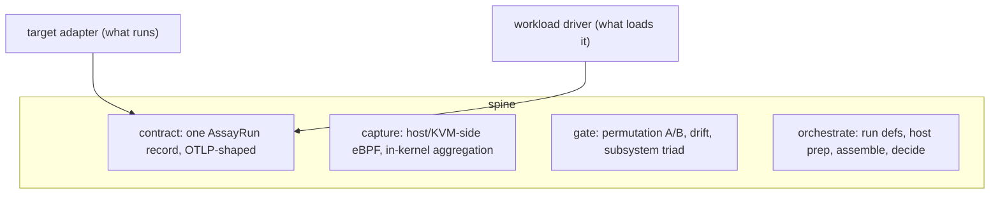

# Assayist

One benchmarking system for VMs, microVMs, unikernels, hypervisors, and eBPF-as-subsystem experiments. Low observer effect, high information, standardised, and honest about what it cannot see.

Reach for it when you want CI-gradeable A/B benchmarks of a guest workload (a full VM, a Firecracker microVM, a unikernel) without putting an agent inside the guest, and a verdict you can trust because the run records how it was measured.

Assayist does not try to standardise the thing under test. It standardises three things around it: a metric contract, a host/KVM-side eBPF capture plane, and a decision gate. Targets and workloads are pluggable adapters that plug into that fixed spine.



The capture plane is universal because it sits host-side on KVM tracepoints and the virtio/tap path, so it observes a full VM, a Firecracker microVM, or a unikernel guest the same way, with no in-guest agent. So one system covers all of those guest types instead of a separate tool per space.

Why "assay": a benchmark run is an assay, a controlled measurement of one preparation against another under stated conditions. The record it produces is an `AssayRun`.

## Try it now

The gate works on any machine, no eBPF host needed. This builds it, generates synthetic runs, and checks all six verdicts against their expected exit codes:

```
./scripts/verify-gate.sh
```

That is the whole decision engine running end to end. The eBPF capture and the full pipeline need a BTF+KVM Linux host; see below.

## Where to go

- **Just want to see it work**: "Try it now" above.
- **Consuming Assayist in another project** (like bpfolio): [Prebuilt releases](#prebuilt-releases-for-consumers), pull the full set with one mise entry, or [`cargo install`](#via-cargo-core-only) the core.
- **Building from source**: [Build](#build).
- **Running the full A/B pipeline**: [The full pipeline](#the-full-pipeline).
- **Writing a benchmark def**: the exhaustive key/flag list is [`docs/config-reference.md`](docs/config-reference.md); worked feature walkthroughs are in [`docs/guides/`](docs/guides/README.md).
- **The record shape**: [`docs/contract-v0.md`](docs/contract-v0.md). **The system design**: [`docs/architecture.md`](docs/architecture.md).

## Build

`mise install` sets up the pinned toolchain (rust + python from `mise.toml`), the same versions CI uses. Without mise, rustup reads `rust-toolchain.toml` and installs the same rust; you supply python yourself for the gate scripts.

Common tasks are defined in mise (`mise tasks` lists them):

```
mise run build       # cargo build --release
mise run test        # workspace tests
mise run test-gate   # the gate scenario suite (six verdicts)
mise run lint        # clippy, warnings denied (matches CI)
mise run demo        # generate runs and judge B vs A with the gate
```

Or drive cargo directly, it is a normal Rust workspace:

```
cargo build --release      # contract, gate, orchestrate, otlp
cargo test                 # tests across the core
```

The gadgets are excluded from the workspace and built per host, because they need BTF, clang, and bpftool. Which kernel fields and tracepoints each gadget depends on is in [`docs/compatibility-matrix.md`](docs/compatibility-matrix.md).

```
cd capture/kvm
bpftool btf dump file /sys/kernel/btf/vmlinux format c > src/bpf/vmlinux.h
cargo build --release
```

`bpftool` is only for regenerating `vmlinux.h` (each gadget commits one, so a normal build needs just clang). The gadgets are CO-RE: they embed the compiled BPF object and relocate against the running kernel's BTF at load, so a binary built once runs on any same-arch BTF host. The `resident` gadget is the exception: pure userspace (mmap + mincore), no BTF, clang, or bpftool.

### Prebuilt releases (for consumers)

A downstream project does not need this source checkout. A tagged release ships one tarball, `assayist-x86_64-linux.tar.gz`, with the orchestrator, the gate, and every capture gadget. Because the gadgets are CO-RE, that set runs on any same-arch BTF host with no rebuild. Pull the lot with one mise entry:

```toml
[tools]
"github:1stvamp/assayist" = "0.1.2"
```

`mise install` then puts `assayist`, `assayist-gate`, and all five capture gadgets on `PATH` together (mise verifies the release's artifact attestations too), and the pinned version flows into each run's identity. The orchestrator shells out to `assayist-gate` for the A/B permutation, so both must be present. The per-host build above is only for developing the gadgets or running on an arch a release does not cover.

Cut a release with `mise run release -- vX.Y.Z` (`scripts/release.sh`): it builds the orchestrator, the gate, and the gadgets, packages the tarball (`bin/` at the archive root), and creates the GitHub release. Releases are cut from a BTF+KVM host, not CI, because the gadgets compile against the host's BTF and stock GitHub runners have no KVM tracepoint structs (`trace_event_raw_kvm_exit`) in their kernel BTF. The binaries are CO-RE, so one cut on any same-arch KVM host runs everywhere. The `vX.Y.Z` tag it creates also triggers the crates.io publish workflow (`.github/workflows/publish.yml`), which runs on a stock runner because the core builds anywhere; keep `workspace.package.version` in `Cargo.toml` in step with the tag.

**Licence split**: userspace is Apache-2.0; the eBPF objects (`capture/*/src/bpf/*.bpf.c`) are GPL-2.0 because kernel tracing helpers require it. Per-file SPDX headers are authoritative. See `LICENSE-APACHE` and `LICENSE-GPL`.

### Via cargo (core only)

The core is on crates.io, so you can `cargo install` the binaries without a checkout:

```
cargo install assayist assayist-gate
```

That gives you the `assayist` orchestrator and the `assayist-gate` binary (the orchestrator shells out to the gate, so install both). `cargo install assayist-capture-resident` adds the residency gadget.

**Note**: cargo delivers the host-agnostic core only. The four eBPF gadgets (kvm, block, net, ctrlplane) are not on crates.io: they need BTF, clang, and bpftool to build per host, so they are not `cargo install`-able. Via cargo you get the gate, the orchestrator's non-eBPF features (inspect, import/export, command adapters, the host-memory delta, per-guest residency, the resident gadget), and nothing that needs in-kernel capture. For the full set including the eBPF gadgets, use the mise release tarball above or build the gadgets per host. If you drive mise, `"cargo:assayist" = "0.1.3"` is the cargo-backed equivalent of the github entry, with the same limitation.

The crate names: `assayist` (orchestrator binary), `assayist-gate`, `assayist-capture-resident`, plus the libraries `assayist-contract` and `assayist-otlp`.

## The gate

Three modes (`ab_permutation`, `longitudinal_drift`, `subsystem_triad`), a non-parametric permutation test, polarity-aware regression detection, and CI exit codes (`0` pass, `1` gate error, `2` fail, `3` contaminated). To drive it directly, generate a set of runs and judge a candidate group B against a baseline group A:

```
cargo build --release -p assayist-gate
python3 scripts/gen_testdata.py /tmp/runs
./target/release/assayist-gate --mode ab_permutation \
  --a /tmp/runs/a{0..9}.json \
  --b /tmp/runs/bsame{0..9}.json     # bsame -> pass, breg -> fail, bcont -> contaminated
```

The permutation test needs at least two runs per group (a 1-vs-1 comparison has nothing to permute, and grades a hollow `pass`). See [`crates/gate/README.md`](crates/gate/README.md) for the decision rules and the findings that shaped them, and [`examples/sample-outcome.json`](examples/sample-outcome.json) for the output shape.

## The full pipeline

On a BTF+KVM host with the gadgets built (or a prebuilt release on `PATH`), `assayist run` drives everything from a def.

You need: a Firecracker kernel and rootfs (the example def expects them at `/var/lib/assayist/vmlinux` and `/var/lib/assayist/rootfs.ext4`, so edit those paths or drop your own there), plus root if you want host prep. Start with a single group, no A/B, to confirm it runs:

```
./target/release/assayist run examples/firecracker-boot-snapshot.assay.yaml --repeat 2
```

Then the full A/B, comparing two builds of the system under test, with host prep applied:

```
./target/release/assayist run examples/firecracker-boot-snapshot.assay.yaml \
  --repeat 4 --a-sut <shaA> --b-sut <shaB> --apply-prep
```

`--a-sut`/`--b-sut` are the git SHAs of the two builds under test; they land in each run's identity. For each parameterisation cell it applies host prep (governor/SMT/THP, verified by read-back), pins vCPU threads if the def asks, boots the target and runs the workload across the capture window, assembles a graded `AssayRun` per repeat, then shells out to the gate and propagates its exit code.

**Note**: `--apply-prep` writes sysfs and needs root. Without it the host is observed read-only, and a run whose tuning the host does not already match grades `invalid`.

The other subcommands:

```
assayist capture examples/firecracker-boot-snapshot.assay.yaml --out run.json   # fire the gadgets once
assayist inspect examples/firecracker-boot-snapshot.assay.yaml                  # parse/validate/observe, read-only
assayist export run.json --out otlp.json                                        # AssayRun -> OTLP
assayist import otlp.json --out run.json                                        # OTLP -> AssayRun (grade: valid)
```

Every flag for every subcommand is in [`docs/config-reference.md`](docs/config-reference.md).

## Guides

The feature surface, one walkthrough each, under [`docs/guides/`](docs/guides/README.md):

- [Comparing two configs](docs/guides/comparing-configs.md): the `compare` A/B axis (config vs config, not build vs build).
- [Firecracker snapshot restore](docs/guides/snapshot-restore.md): driving an agentless guest over vsock, the host-memory delta, per-guest snapshot residency, concurrent sandboxes, file vs userfaultfd backends, and streaming restore over a FUSE mount. This is the path bpfolio exercises; see [`docs/bpfolio-integration.md`](docs/bpfolio-integration.md).
- [QEMU, Cloud Hypervisor, and unikernels](docs/guides/other-vmms.md): cold-booting full VMs and unikernels through the same VMM-agnostic capture plane.

## The contract is the load-bearing piece

Everything agrees on one record shape, so it is the thing designed most carefully and the most expensive to change once published. It is drawn OTLP-shaped where concepts overlap (a 128-bit `run_id` becomes an OTLP `trace_id`; log2 histograms map to OTel exponential histograms at scale 0), so an OTLP import/export plugin is a rote transform rather than a rewrite. Three concepts have no OTLP equivalent and stay native because they enforce the guarantees: the host fingerprint (reproducibility), the cardinality budget (density-safety), and the observer-effect self-metrics (the low-overhead claim, carried by the ProbeCost numbers that back it up). The self-metrics are gated: a probe that runs over its budget marks the run contaminated, so the overhead claim is checked at grade time rather than taken on faith. Read [`docs/contract-v0.md`](docs/contract-v0.md) before changing the schema.

## Status

| Component | State |
|---|---|
| Metric contract (`docs/contract-v0.md`, `contract/assay-run.schema.json`) | v0 |
| `crates/contract` (typed producer-side model, grading) | built, tested |
| `crates/gate` (permutation A/B, drift, subsystem triad) | built, tested, six scenarios verified |
| `crates/orchestrate` (run defs -> host prep -> capture -> assemble -> gate) | v0 built: `run`/`capture`/`inspect`/`export`/`import` |
| OTLP export + import (`crates/otlp`) | built, tested; wired as `assayist export` / `import` |
| `capture/kvm` (exit-handling latency) | built and run: captured 100k+ real exits from a Firecracker microVM |
| `capture/block` (block-IO latency per device) | built and run: per-device read/write latency + byte counters over a cold restore; `--hires` emits a log-linear histogram so the gate can grade the tail |
| `capture/net` (tap/virtio-net counters + size histograms) | built and run: attaches XDP/TC and emits; real packet signal needs a tap/NIC |
| `capture/ctrlplane` (run-queue latency, on-CPU) | built and run: captured run-queue latency from the sched tracepoints; scope with `--cgroup` |
| `capture/resident` (snapshot residency: mincore on the mem file) | built and run: pure userspace (no BTF), reports resident/total pages + fraction |
| native adapters: `firecracker` + `qemu` + `cloud-hypervisor` + `unikernel` targets, `fio` + `wrk` + `vsock` workloads (`crates/orchestrate/src/native.rs`) | built, tested; firecracker + fio validated on real KVM, `vsock` drove a restored microVM's function server, `qemu`/`cloud-hypervisor` cold-booted full VMs, `unikernel` booted a Nanos guest, all with KVM exits the kvm gadget captured unchanged |

Verified by execution: the core (contract, gate, OTLP round-trip), and the whole pipeline end-to-end on a nested-KVM host. Every capture gadget has been built and run on a BTF host; the four eBPF ones each need clang and bpftool to build per-host, `resident` needs neither.

## Layout

```
assayist/
  Cargo.toml               workspace: core members, gadgets excluded
  rust-toolchain.toml
  contract/
    assay-run.schema.json  machine-checkable contract (JSON Schema)
  docs/
    README.md              the docs index
    contract-v0.md         the metric contract spec (normative)
    config-reference.md    every def key, CLI flag, and gadget flag
    architecture.md        how the shipped system fits together
    design-brief.md        the original pre-implementation brief (historical)
    compatibility-matrix.md per-kernel field/tracepoint deps for gadgets
    research-survey.md      the evidence behind the low-overhead design
    bpfolio-integration.md  bpfolio milestone -> Assayist feature map
    guides/                feature walkthroughs
  crates/                  host-agnostic core (workspace members)
    contract/              typed AssayRun, grading, fragment merge
    gate/                  the decision engine
    orchestrate/           the orchestrator; native.rs holds the firecracker/qemu/
                           cloud-hypervisor/unikernel targets and fio/wrk/vsock workloads
    otlp/                  OTLP export/import
  capture/                 eBPF gadgets (standalone, build per BTF host)
    kvm/  block/  net/  ctrlplane/  resident/
  examples/
    firecracker-boot-snapshot.assay.yaml
    sample-outcome.json
```

The data flow (def -> graded runs -> verdict) and the spine/adapters design are in [`docs/architecture.md`](docs/architecture.md).

## What Assayist will not do

- See inside agentless guests (unikernels, microVMs with no agent). Host-side eBPF sees exits, I/O, vCPU scheduling, and the packet path, not the guest's own userspace. Full VMs that run an agent emit their own OTLP and get correlated by `trace_id`.
- Compare across hosts. The gate is same-host A/B or same-host drift; the fingerprint exists partly to make cross-host comparison fail loudly.
- Represent unbounded cardinality. There is no such thing in the contract, on purpose.

## Licence

Apache-2.0 (userspace) and GPL-2.0 (eBPF objects). See the two LICENSE files and per-file SPDX headers.
